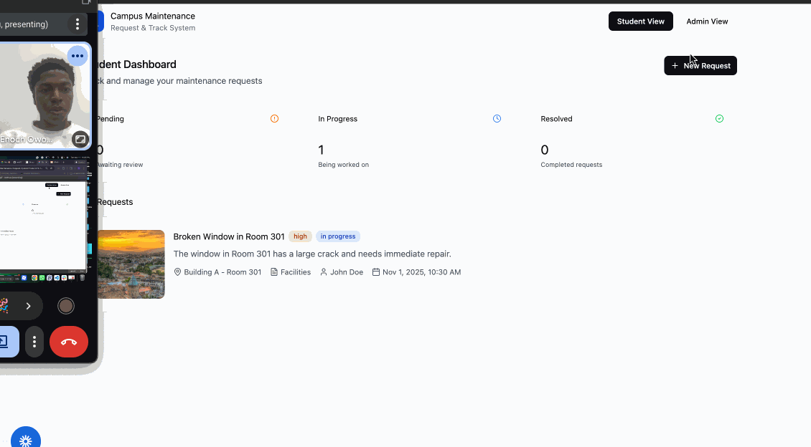

# ServiceLink: Campus Maintenance Request System

CodePath WEB103 Final Project

Designed and developed by: Enoch Owoade, Jesse Rosenthal, Joshua Holguin

🔗 Link to deployed app: https://service-link.onrender.com/

## About

### Description and Purpose

ServiceLink is a web application that allows students, faculty, and staff to report maintenance or IT issues around campus (e.g., broken lights, Wi-Fi outages, faulty lab equipment).
Administrators and technicians can review, prioritize, assign, and resolve these requests efficiently.
The platform improves communication between the campus community and the facilities department by providing real-time status tracking and automated updates.

### Inspiration

The inspiration for ServiceLink came from observing the inefficiency of traditional maintenance request systems on many campuses.
At most universities, students must email or physically report issues like broken AC units, malfunctioning projectors, or water leaks often without any way to track their request status.
This results in frustration, miscommunication, and redundant work for both students and staff.

By combining these ideas into a student-friendly, web-based platform, ServiceLink makes it easier for everyone on campus to “see a problem, report it, and track it.”

## Tech Stack

Frontend: React, React Router, Axios, Tailwind

Backend: Express.js, Node.js, PostgreSQL

## Features

### Request Submission Form ✅

Users can submit maintenance or IT requests through a simple online form that captures key details such as title, description, location, category, urgency, and optional image upload.
This replaces paper or email-based reporting with a more efficient digital workflow.



### Request Tracking Dashboard ✅

Each user has access to a personal dashboard displaying all submitted requests along with their current status (Pending, In Progress, or Resolved).
This feature promotes transparency and accountability, ensuring users can easily follow up on issues.

### Admin & Technician Panel ✅

Administrators and technicians can log in to view, filter, and manage all maintenance requests.
They can assign tasks, update request statuses, and add resolution notes once the issue is resolved.

### Filtering and Sorting ✅

Admins and technicians can filter requests by category, urgency, or status, and sort them by date or priority.
This feature helps prioritize high-impact issues and maintain organized workflows.

### Resolution Management (One-to-One Relationship) ✅

Each request has a corresponding resolution record that stores details about how the issue was fixed, who resolved it, and when.
This ensures proper documentation and allows staff to maintain a history of completed work.

### Real-Time Notifications & Feedback ✅

Users receive confirmation messages or toast alerts when submitting, updating, or resolving a request.
This immediate feedback improves user experience and ensures communication between reporters and maintenance staff remains seamless.

### Walkthrough Demo


### [ADDITIONAL FEATURES GO HERE - ADD ALL FEATURES HERE IN THE FORMAT ABOVE; you will check these off and add gifs as you complete them]

## Installation Instructions

# Service Link — Final Project

This repository contains a two-part web application (client + server) for submitting and tracking service requests.

Quick overview

- `client/vite-project`: React front-end (Vite)
- `server`: Node/Express back-end with Postgres (pg)

Setup (local development)

1. Server

```bash
cd server
cp .env.example .env   # fill in your values (do NOT commit real secrets)
npm install
npm run reset-db       # creates tables
npm run dev            # requires nodemon (install globally or add to devDependencies)
```

2. Client

```bash
cd client/vite-project
npm install
npm run dev
```

Testing authentication via curl (example)

```bash
# create a user
curl -i -X POST http://localhost:3000/api \
	-H "Content-Type: application/json" \
	-d '{"username":"testuser","email":"test@example.com","role":"STUDENT","password":"secret123"}'

# login and save cookie
curl -i -c cookies.txt -X POST http://localhost:3000/api/login \
	-H "Content-Type: application/json" \
	-d '{"email":"test@example.com","password":"secret123"}'

# check current session
curl -i -b cookies.txt http://localhost:3000/api/me
```

Notes

- Keep real secrets out of source control. Use `.env` or host-provided secret storage.
- For production behind HTTPS, set `cookie.secure = true` and `app.set('trust proxy', 1)`.
