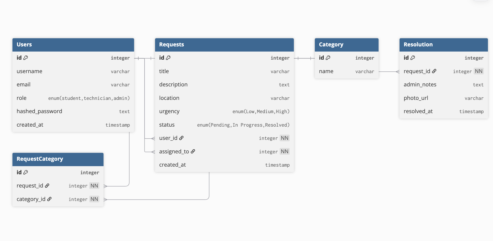

# Entity Relationship Diagram

Reference the Creating an Entity Relationship Diagram final project guide in the course portal for more information about how to complete this deliverable.

## Create the List of Tables

- Users
- Requests
- Category
- Resolution
- RequestCategory

## Entity Relationship Diagram

---

**Users**
| Column Name | Type | Description |
| --------------- | -------------------------------------- | ------------------------------------------------------- |
| id | integer | Primary key for each user |
| username | varchar | Username of the user |
| email | varchar | Unique email of the user |
| role | enum('student', 'technician', 'admin') | Defines whether user is a student, technician, or admin |
| hashed_password | text | Hashed password for secure login |
| created_at | timestamp | Timestamp when the user account was created |

---

**Requests**
| Column Name | Type | Description |
| ----------- | ------------------------------------------ | -------------------------------------------------------------- |
| id | integer | Primary key for each request |
| title | varchar | Short title of the maintenance issue |
| description | text | Detailed description of the problem |
| location | varchar | Location where the issue occurred |
| urgency | enum('Low', 'Medium', 'High') | Indicates priority level of the request |
| status | enum('Pending', 'In Progress', 'Resolved') | Current status of the request |
| user_id | integer | Foreign key referencing the student who submitted the request |
| assigned_to | integer | Foreign key referencing the technician assigned to the request |
| created_at | timestamp | Timestamp when the request was created |

---

**Category**
| Column Name | Type | Description |
| ----------- | ------- | ---------------------------------------------- |
| category_id | integer | Primary key for each category |
| name | varchar | Category name (e.g., Electrical, Plumbing, IT) |

**RequestCategory**
| Column Name | Type | Description |
| ----------- | ------- | ------------------------------------ |
| id | integer | Primary key for the join record |
| request_id | integer | Foreign key referencing the request |
| category_id | integer | Foreign key referencing the category |

---

**Resolution**
| Column Name | Type | Description |
| ----------- | --------- | ------------------------------------------------------ |
| id | integer | Primary key for each resolution record |
| request_id | integer | Unique foreign key referencing the request it resolves |
| admin_notes | text | Notes or summary of how the issue was fixed |
| photo_url | varchar | Optional URL of the photo proof of the fix |
| resolved_at | timestamp | Timestamp when the request was resolved |
