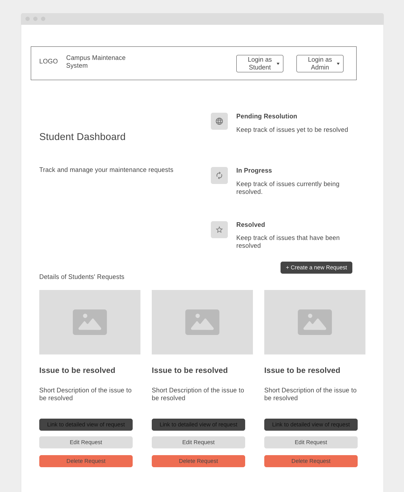
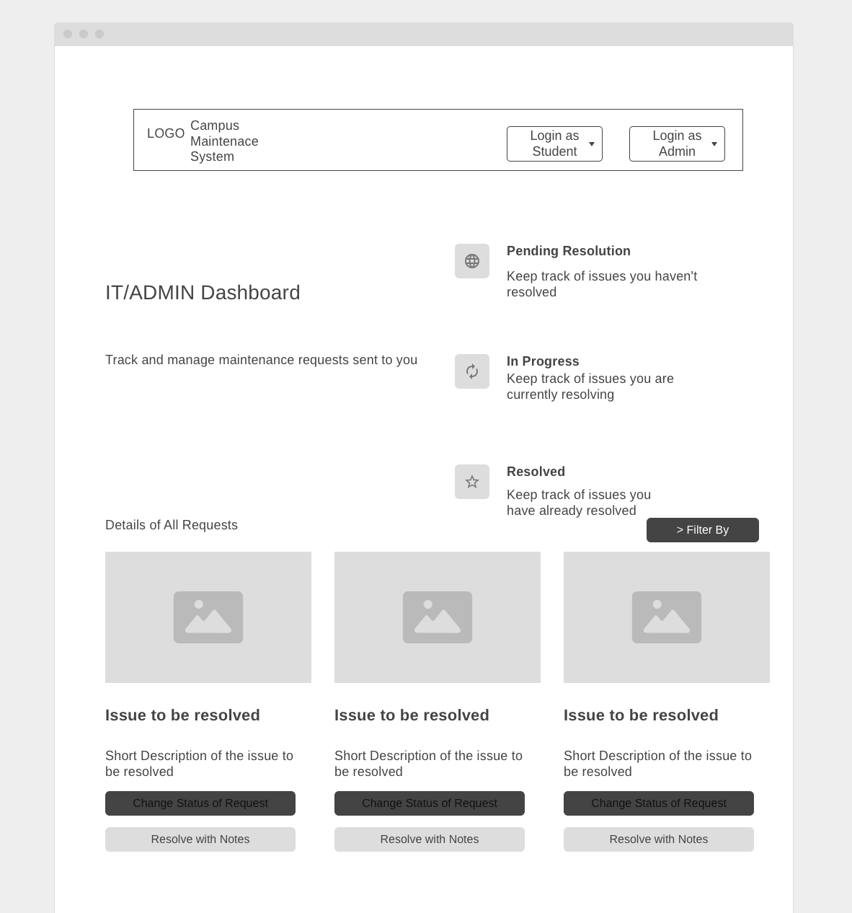
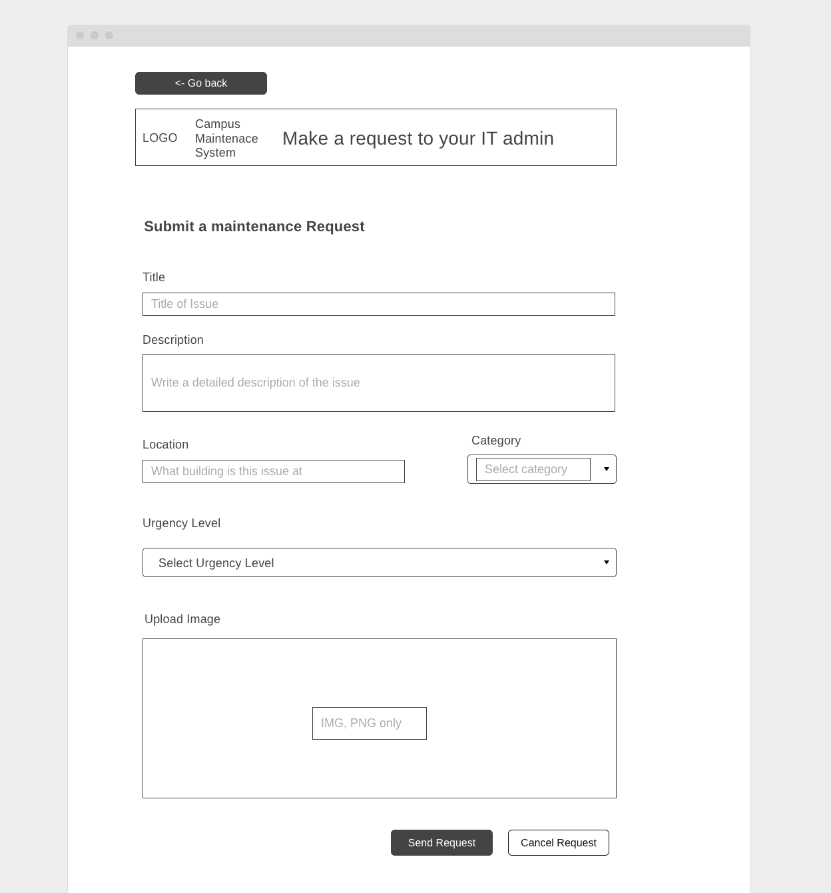
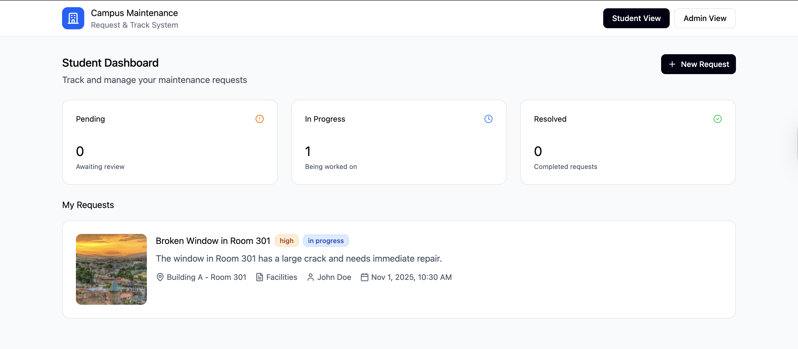
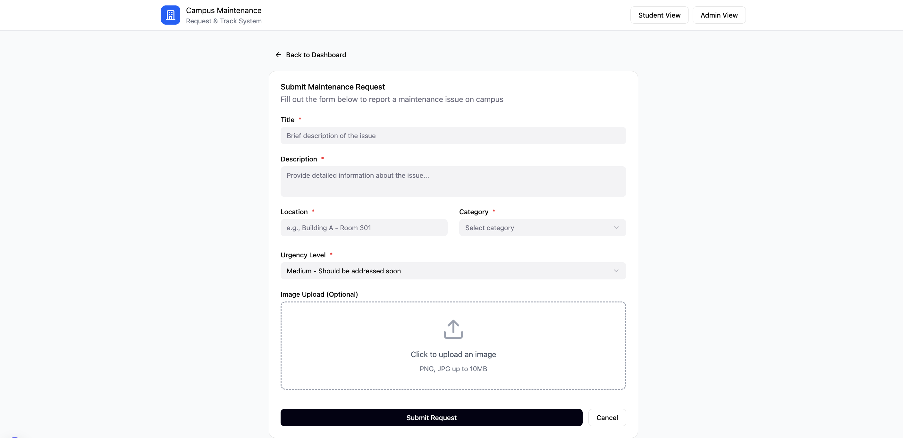
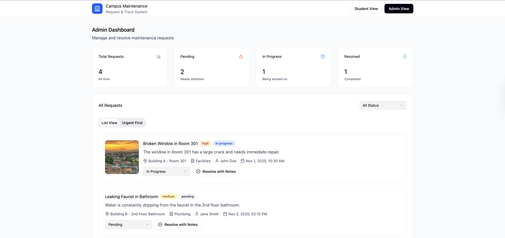

# Wireframes

Reference the Creating an Entity Relationship Diagram final project guide in the course portal for more information about how to complete this deliverable.

## List of Pages

- ⭐ Student Dashboard Page
- ⭐ Technician Dashboard Page
- ⭐ Request Submission Page
- Admin Dashboard

## Wireframe 1: Student Dashboard

## Wireframe 2: Technician Dashboard

## Wireframe 3: Request Submission Form Page

## Mock Ups

